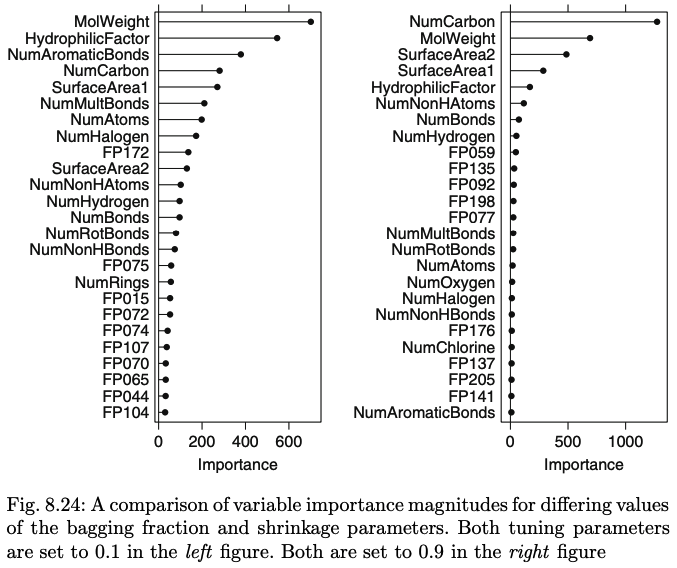

*Textbook: Max Kuhn and Kjell Johnson. Applied Predictive Modeling. Springer, New York, 2013.*

```{r message=F, warning=F}
library(caret)
library(mlbench)
library(randomForest)
library(party)
library(dplyr)
library(gbm)
library(Cubist)
library(rpart)
library(partykit)
```

## Exercise 8.1

Recreate the simulated data from Exercise 7.2:

```{r}
set.seed(420)
simulated = mlbench.friedman1(200, sd = 1)
simulated = cbind(simulated$x, simulated$y)
simulated = as.data.frame(simulated)
colnames(simulated)[ncol(simulated)] = "y"
```

### (a) Fit a random forest model to all of the predictors, then estimate the variable importance scores

```{r}
model_rf = randomForest(y ~ ., data = simulated, importance = TRUE, ntree = 1000)
rf_Imp = varImp(model_rf, scale = FALSE)
```

Did the random forest model significantly use the uninformative predictors (V6 – V10)?

```{r}
rf_Imp
```

The predictors V6-V10 have much smaller weights than the other predictors. It does not look like the random forest model significantly used the uninformative predictors.

### (b) Now add an additional predictor that is highly correlated with one of the informative predictors. For example:

```{r}
simulated$duplicate1 <- simulated$V1 + rnorm(200) * .1
cor(simulated$duplicate1, simulated$V1)
```
*Fit another random forest model to these data. Did the importance score for V1 change? What happens when you add another predictor that is also highly correlated with V1?*

```{r}
model_rf2 <- randomForest(y ~ ., data= simulated, importance= TRUE, ntree= 1000)
rf_imp2 <- varImp(model_rf2, scale=FALSE)
rf_imp2
```

The importance of V1 dropped after adding another predictor. The correlation between V1 and duplicate1 is very high at 0.94. If we use model2, more predictors may be selected than necessary and variable importance is affected.


### (c) Use the cforest function in the party package to fit a random forest model using the conditional inference trees. The party package function varimp can calculate predictor importance. The conditional argument of that function toggles between the traditional importance measure and the modified version described in Strobl et al. (2007). Do these importances show the same pattern as the tradtional random forest model?


```{r}
model_cforest <- cforest(y ~ ., data= simulated)
cf_imp3<-varimp(model_cforest) %>% sort(decreasing = TRUE) # Without conditional
cf_imp4<-varimp(model_cforest, conditional = TRUE) %>% sort(decreasing=TRUE) # With conditional 
as.data.frame(cbind(Model2 = rf_imp2, Conditional = cf_imp3, Unconditional = cf_imp4))
```

Importance of variable V1 increased when wen compare traditional to conditional. Importance of V4 and duplicate decreased. It looks like in conditional, the correlation is taken into account and variable importance is adjusted accordingly.

### (d) Repeat this process with different tree models, such as boosted trees and Cubist. Does the same pattern occur?

```{r}
#Running gbm
gbmGrid = expand.grid(interaction.depth = seq(1,5, by=2), 
                      n.trees = seq(100, 1000, by = 100), 
                      shrinkage = 0.1, 
                      n.minobsinnode = 5)
model_gbm = train(y ~ ., data = simulated, 
                  tuneGrid = gbmGrid, verbose = FALSE, 
                  method = 'gbm')
gbm_imp<-varImp(model_gbm)

```

```{r}
#Running cubist
model_cubist <- cubist(simulated[,-11], simulated[, 11])
cubist_imp<-varImp(model_cubist)
#Compare
df = as.data.frame(cbind(gbm_imp$importance, cubist_imp))
names(df) = c("boosted", "cubist")
df
```

We see that V6-V10 are still among the lowest in importance just like the traditional and conditional models. V4 is still the top predictor. The pattern is the same.


## Exercise 8.2

### (a) Use a simulation to show tree bias with different granularities

Below are 5 distinct simulated variables with different granularities. The response variable is X1 with some noise.

```{r message=F, warning=F}
set.seed(450)
X1 <- sample(1:1000 / 1000, 252, replace = TRUE) # 1000 distinct values
X2 <- sample(1:100 / 100, 252, replace = TRUE)     # 100 distinct values
X3 <-sample(1:10 / 10, 252, replace = TRUE)   # 10 distinct values
X4 <- sample(1:5 / 5, 252, replace = TRUE)       # 5 distinct values
X5<- rep(1, 252)                                # no distinct values
Y <- X1 + rnorm(100, mean = 0, sd = 1.5)

df <- data.frame(X1, X2, X3, X4, X5, Y)

# Rpart
rpart_model <- rpart(Y ~., data=df)
varImp(rpart_model)
```
X1 is the most important predictor with the highest level of granularity. This is followed by X2 and X4. There seems to be present a selection bias with more distinct values favoured.


## Exercise 8.3

*In stochastic gradient boosting the bagging fraction and learning rate will govern the construction of the trees as they are guided by the gradient. Although the optimal values of these parameters should be obtained through the tuning process, it is helpful to understand how the magnitudes of these parameters affect magnitudes of variable importance. Figure 8.24 provides the variable importance plots for boosting using two extreme values for the bagging fraction (0.1 and 0.9) and the learning rate (0.1 and 0.9) for the solubility data. The left-hand plot has both parameters set to 0.1, and the right-hand plot has both set to 0.9:*



### (a) Why does the model on the right focus its importance on just the first few of predictors, whereas the model on the left spreads importance across more predictors?

The model on the right focuses on a few variables as it has a higher learning rate along with a higher bagging rate. This means that a larger portion of the data is used, increasing the correlation at each iteration. Thus only a few of the variables have high importance.

### (b) Which model do you think would be more predictive of other samples

The model with larger learning and bagging will most likely overfit as it considers fewer variables. The model on the left has a higher chance of being more predictive of other samples.

### (c) How would increasing interaction depth affect the slope of predictor importance for either model in Fig 8.24?

Interaction depth is also same like tree depth. As the interaction depth increases, more predictors are included. The RMSE error will lower and the steeper the slop of importance of predictors.


## Exercise 8.7

*Refer to Exercises 6.3 and 7.5 which describe a chemical manufacturing process. Use the same data imputation, data splitting, and pre-processing steps as before and train several tree-based models:*

```{r}
library(AppliedPredictiveModeling)
data(ChemicalManufacturingProcess)
# Impute the missing values using bagImpute
cmp_impute <- preProcess(ChemicalManufacturingProcess[,-c(1)], method=c('bagImpute'))
# Replace
cmp <- predict(cmp_impute, ChemicalManufacturingProcess[,-c(1)])
# Splitting the data into training and test datasets
set.seed(480)
train_r <- createDataPartition(ChemicalManufacturingProcess$Yield, p=0.8, list=FALSE)
X_train <- cmp[train_r,]
y_train <- ChemicalManufacturingProcess$Yield[train_r]
X_test <- cmp[-train_r,]
y_test <- ChemicalManufacturingProcess$Yield[-train_r]
```


### Single Tree

```{r message=F, warning=F}
set.seed(330)
model_rpart <- train(x= X_train, y= y_train, method="rpart", tuneLength=10, control= rpart.control(maxdepth=2))
model_rpart
```

### Random Forest


```{r}
set.seed(340)
model_rf3<- train(X_train, y_train, method='rf', tuneLength = 10)
model_rf3
```


### Gradient Boosting

```{r}
set.seed(350)
grid <- expand.grid(n.trees=c(50, 100, 150, 200), 
                    interaction.depth=c(1, 5, 10, 15), 
                    shrinkage=c(0.01, 0.1, 0.5), 
                    n.minobsinnode=c(5, 10, 15))
model_gbm1 <- train(x = X_train,y = y_train, method = 'gbm',tuneGrid = grid, verbose = FALSE)

model_gbm1$bestTune
```

### (a) Which tree-based regression model gives the optimal resampling and test set performance

Let us resample and have a look

```{r}
summary(resamples(list(Single_True = model_rpart, Random_Forest = model_rf3, Gradient_Boosting=model_gbm1)))
```

Gradient Boosting seems to be the best model as the RMSE value looks better than those from the other models. We need to test the model on the test set.


```{r}
#Function for test data
test_performance <- function(models, testData, testTarget) {
  method <- c()
  res <- data.frame()
  for(model in models){
    method <- c(method, model$method)
    pred <- predict(model, newdata=testData)
    res <- rbind(res, t(postResample(pred=pred, obs=testTarget)))
  }
  row.names(res) <- method
  return(res)
}
#List te models
models <- list(model_rpart, model_rf3, model_gbm1)
#Run the function
performance <- test_performance(models, X_test, y_test)
performance
```

Again, Gradient boosting gives the lowest RMSE and comes up as the best model.


### (b) Which predictors are most important in the optimal tree-based regression model? Do either the biological or process variables dominate the list? How do the top 10 important predictors compare to the top 10 predictors from the optimal linear and nonlinear models?

From the previous homeworks on linear and non linear models, pls and svm were the best models that came up. We are running it here again to compare

```{r message=F, warning=F}
model_pls <- train(x = X_train,y = y_train, method='pls', metric='RMSE',
                   tuneLength=20, trControl = trainControl(method='cv'))
(pls_imp = varImp(model_pls))
```

```{r message=F, warning=F}
set.seed(424)
svm_model <- train(x = X_train,y = y_train,
                        method = "svmRadial",
                        tuneLength=10,
                        preProc = c("center", "scale"))
(svm_imp = varImp(svm_model))
```

Let us compare the three lists of important variables

```{r}
p1<-plot(svm_imp, top=10, main='SVM')
p2<-plot(pls_imp, top=10, main='PLS')
gbm_imp<-varImp(model_gbm1)
p3<-plot(gbm_imp, top=10, main='GBM')
gridExtra::grid.arrange(p1, p2,p3,  ncol = 3)
```

Gradient Boosting and SVM have both Biological and Manufacturing predictors in the top 10, whereas Partial least squares linear model is dominated by manufacturing predictors. Manufacturing Process32 seems to be an important variable in all three models.


### (c) Plot the optimal single true with the distribution of yield in the terminal nodes. Does this view of the data provide additional knowledge about the biological or process predictors and their relationship with yield?

```{r}
model_rpart$finalModel
rpart.plot::rpart.plot(model_rpart$finalModel, box.palette = "RdBu", shadow.col = "blue", nn = TRUE)
```

The tree shows that the split begins with ManfucturingPRocess32 at 160. If it is less than 160, the yield will be 39. If it is more than 160, the yield will be 41. The tree branches to terminal nodes and the yield can improve upto 42. The tree shows the relationship with the predictors and their relationship with yield. The higher the values, the higher the yield according to this tree. 


