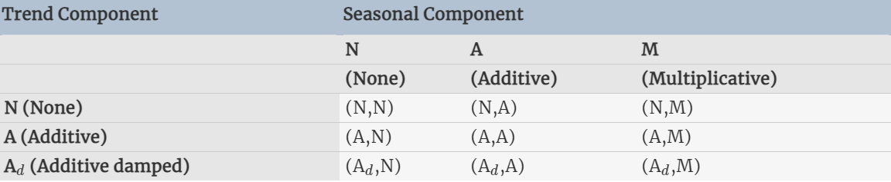
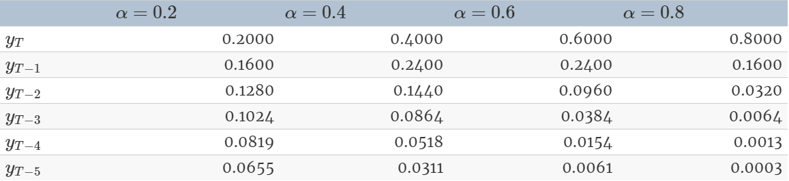
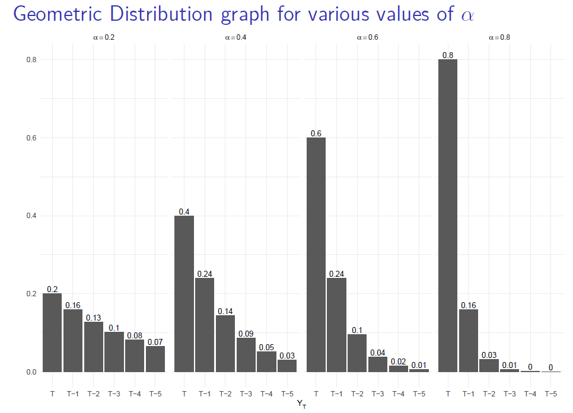

*Textbook: Hyndman, R.J., & Athanasopoulos, G. (2018) Forecasting: principles and practice, 2nd edition, OTexts: Melbourne, Australia.*

### **What is Exponential Smoothing**

Exponential smoothing is forecasting of future observations using weighted averages of
past observations, with the weights decaying exponentially as observations recede further into the past.

Where naive forecasting places 100% weight on the most recent observation and moving averages place equal weight on k values, exponential smoothing allows for weighted averages where greater weight can be placed on recent observations and lesser weight on older observations.

### **Exponential Smoothing Methods**

1.Simple Exponential weighted average — Recent observations get higher weight, older observations less weight. Suitable for data with no clear trend or seasonal pattern.

2. Holt's Linear Trend method - Extended simple exponential smoothing to deal with data with a trend.

3. Holt-Winters Seasonal method — Extended Holt's method to capture seasonality

4. State Space—ETS models 

<center></center>
<center></center>


### **Simple Exponential Smoothing**

The simplest of the exponentially smoothing methods is called “simple exponential smoothing” (SES). SES is suitable for data with no trend or seasonal pattern. 

For exponential smoothing, we weigh the recent observations more heavily than older observations. The weight of each observation is determined through the use of a smoothing parameter, which we will denote $\alpha$. For a data set with T observations, we calculate our predicted value  $\hat y_{t+1}$, which will be based on $y_1$ through $y_t$ as follows: 

$\hat y_{t+1}=\alpha y_t + \alpha (1-\alpha)y_{t-1} +...+\alpha (1-\alpha)^{t-1}y_1$

The above equation is called the weighted average form where $\alpha$ is the smoothing parameter and alpha lies between 0 to 1. There is also the component form which uses the following set of equations:

Forecast Equation

$\hat y_{t+1}=l_t$

Smoothing Equation

$l_t= \alpha y_t + (1-\alpha)l_{t-1}$

In both equations we can see that the most weight is placed on the most recent observation. When $\alpha$ is closer to 0, we consider this slow learning because the algorithm gives historical data more weight. When $\alpha$ is closer to 1, we consider this fast learning because the algorithm gives more weight to the most recent observation and therefore, recent changes in the data will have a bigger impact on forecasted values. 

The table below shows the weights attached to observations for four different values of $\alpha$ when forecasting using simple exponential smoothing. Note that the sum of the weights even for a small value of $\alpha$ will be approximately one for any reasonable sample size.

<center></center>

The decay is more clearly understood from the following chart:

<center></center>

*Example*

We will use SES to forecast oil production in Saudi Arabia. We will be using different values of $\alpha$ to compare the forecasts.

```{r include=F, message=F, warning=F}
#read in data
library(fpp2)
library(stringr) 
library(gridExtra)
data("austourists")
data("hyndsight")
library(forecast)
library(readr)
library(stringr)
library(tidyverse)
library(ggplot2)
theme_set(theme_classic())
```

```{r}
oildata<-window(oil, start=1996)
```

```{r message=F, warning=F}
#plot using different values of alpha
fit1 <- ses(oildata, alpha=0.2, initial="simple", h=5)
fit2 <- ses(oildata, alpha=0.6, initial="simple", h=5)
fit3 <- ses(oildata, initial="simple", h=5)
plot(fit1, plot.conf=FALSE, ylab="Oil (millions of tonnes)",
  xlab="Year", main="SES using different values of alpha", fcol="white", type="o")
lines(fitted(fit1), col="blue", type="o")
lines(fitted(fit2), col="red", type="o")
lines(fitted(fit3), col="darkgreen", type="o")
lines(fit1$mean, col="blue", type="o")
lines(fit2$mean, col="red", type="o")
lines(fit3$mean, col="darkgreen", type="o")
legend("topleft",lty=1, col=c(1,"blue","red","green"), 
  c("data", expression(alpha == 0.2), expression(alpha == 0.6),
  expression(alpha == 0.83)),pch=1)
```
```{r}
summary(fit3)
checkresiduals(fit3)
```

The SES method comes up with point forecasts. The prediction intervals show that there is considerable uncertainty in the future values of oil production over the five-year forecast period. So interpreting the point forecasts without accounting for the large uncertainty can be very misleading.

### **Holt’s Linear Trend method**

Holt (1957) extended simple exponential smoothing to allow the forecasting of data with a trend. This method involves a forecast equation and two smoothing equations (one for the level and one for the trend):

\begin{align*} 
\text{Forecast equation}&& \hat{y}_{t+h|t} &= \ell_{t} + hb_{t} \\
\text{Level equation}&& \ell_{t} &= \alpha y_{t} + (1 - \alpha)(\ell_{t-1} + b_{t-1})\\
\text{Trend equation}&& b_{t} &= \beta^*(\ell_{t} - \ell_{t-1}) + (1 -\beta^*)b_{t-1} 
\end{align*}

$l_t$ denotes an estimate of the level of the series at time t 

$b_t$ denotes an estimate of the trend (slope) of the series at time t 

$\alpha$ is the smoothing parameter for the level, 0≤α≤1 

$\beta*$∗ is the smoothing parameter for the trend, 0≤β∗≤1 (we denote this as $\beta*$∗∗ instead of $\beta$. The trend equation shows that $b_t$ is a weighted average of the estimated trend at time t based on $\ell_{t} - \ell_{t-1} + (1 -\beta^*)b_{t-1}$, the previous estimate of the trend.  The special case when  $\beta^*=0$ is known as SES with drift.

*Example*

We will work on the Australian air passengers data, which has a trend component.

```{r}
air<-window(ausair, start=1990)
```

```{r}
fit1 <- holt(air, beta=0.2, h=5)
fit2 <- holt(air,  beta=0.6,  h=5)
fit3 <- holt(air,  beta=0.9,  h=5)
plot(fit1, ylab="Australia air passengers (millions)",
  xlab="Year", main="Holt's Linear Trend Method with different beta", fcol="white")
#lines(fitted(fit1), col="navyblue")
#lines(fitted(fit2), col="red")
#lines(fitted(fit3), col="darkgreen")
lines(fit1$mean, col="navyblue")
lines(fit2$mean, col="red")
lines(fit3$mean, col="darkgreen")
legend("topleft",lty=1, col=c(1,"navyblue","red","darkgreen"), 
  c("data", expression(beta == 0.2), expression(beta == 0.6),
  expression(beta == 0.9)),pch=1)
```
```{r}
summary(fit2)
checkresiduals(fit2)
```


***Exponential trend method***

A variation from Holt’s linear trend method is achieved by allowing the level and the slope to be multiplied rather than added:

\begin{align*}
\hat{y}_{t+h|t} &= \ell_{t} b_{t}^h\\ 
\ell_{t} &= \alpha y_{t} + (1 - \alpha)(\ell_{t-1} b_{t-1})\\ 
b_{t} &= \beta^*\frac{\ell_{t}}{ \ell_{t-1}} + (1 -\beta^*)b_{t-1}
\end{align*}

where $b_t$ now represents an estimated growth rate (in relative terms rather than absolute) which is multiplied rather than added to the estimated level. The trend in the forecast function is now exponential rather than linear, so that the forecasts project a constant growth rate rather than a constant slope.

***Dampened Trend***

The forecasts generated by Holt’s linear method display a constant trend (increasing or decreasing) indefinitely into the future. Empirical evidence indicates that these methods tend to over-forecast, especially for longer forecast horizons. Motivated by this observation, Gardner & McKenzie (1985) introduced a parameter that “dampens” the trend to a flat line some time in the future. 

*Additive damped trend*

In conjunction with the smoothing parameters $\alpha$ and $\beta$, (with values between 0 and 1 as in Holt’s method), this method also includes a damping parameter 0<$\phi$<1.

\begin{align*} 
\hat{y}_{t+h|t} &= \ell_{t} + (\phi+\phi^2 + \dots + \phi^{h}) b_{t} \\ 
\ell_{t} &= \alpha y_{t} + (1 - \alpha)(\ell_{t-1} + \phi b_{t-1})\\ 
b_{t}  &= \beta^*(\ell_{t} - \ell_{t-1}) + (1 -\beta^*)\phi b_{t-1}.
\end{align*}

If $\phi=1$ the method is identical to Holt’s linear method. For values between 0 and 1, $\phi$ dampens the trend so that it approaches a constant some time in the future.

*Multiplicative damped trend*

This method introduces a damping parameter to the exponential trend method:

\begin{align*} \hat{y}_{t+h|t} &=
\ell_{t}b_{t}^{(\phi+\phi^2 + \dots + \phi^{h})} \\
\ell_{t} &= \alpha y_{t} + (1 - \alpha)\ell_{t-1} b^\phi_{t-1}\\ 
b_{t} &= \beta^*\frac{\ell_{t}}{\ell_{t-1}} + (1 -\beta^*)b_{t-1}^{\phi}. 
\end{align*}

This method will produce even more conservative forecasts than the additive damped trend method when compared to Holt’s linear method.

*Example*

We will work on the Australian air passengers data, which has a trend component..

```{r}
#Fit different models using the different methods
fit1 <- ses(air, h=15) # N,N
fit2 <- holt(air, h=15) # A,N
fit3 <- holt(air,exponential=TRUE, h=15) # M,N
fit4 <- holt(air,damped=TRUE, h=15) #A_d, N
fit5 <- holt(air,exponential=TRUE,damped=TRUE, h=15) #M_d, N
#Plot
plot(fit3, type="o", main="Compare forecasts using different methods", ylab="Australia air passengers (millions)", flwd=1)
lines(window(air,start=1990),type="o")
lines(fit1$mean,col=2)
lines(fit2$mean,col=3)
lines(fit4$mean,col=5)
lines(fit5$mean,col=6)
legend("topleft", lty=1, pch=1, col=1:6,
    c("Data","SES","Holt's","Exponential",
      "Additive Damped","Multiplicative Damped"))
```
```{r}
data.frame(Method = c("Ses", "Holt", "Exponential", "Additive damped", "Multiplicative damped"),
           RMSE = c(accuracy(fit1)[2],
                    accuracy(fit2)[2],
                    accuracy(fit3)[2],
                    accuracy(fit4)[2],
                    accuracy(fit5)[2])) %>% 
  knitr::kable(caption = "RMSE for each variation of the method") %>%
  kableExtra::kable_styling(bootstrap_options = "striped", full_width = FALSE)
```

### <b>Holt-Winters' Seasonal Method</b>

An extension of Holt's method to capture seasonality.
    
Comprised of forecast Equation and three smoothing equations:
                - One for the level
                - One for the trend
                - One for the seasonal component 
        with corresponding smoothing parameters: $$ \alpha,   \beta*,  and  \gamma $$
        


There are two variations to this method that differ in the nature of the seasonal component. 

First, the additive method is preferred when the seasonal variations are roughly constant through the series, 


With this method, the seasonal component is expressed in absolute terms in the scale of the observed series, and in the level equation the series is seasonally adjusted by subtracting the seasonal component. Within each year, the seasonal component will add up to approximately zero.


Second, the multiplicative method is preferred when the seasonal variations are changing proportional to the level of the series. 


With the multiplicative method, the seasonal component is expressed in relative terms (percentages), and the series is seasonally adjusted by dividing through by the seasonal component. Within each year, the seasonal component will sum up to $\m$ approximately .
    


```{r}
aust <- window(austourists,start=2005)
fit1 <- hw(aust,seasonal="additive")
fit2 <- hw(aust,seasonal="multiplicative")
autoplot(aust) +
autolayer(fit1, series="HW additive forecasts", PI=FALSE) +
autolayer(fit2, series="HW multiplicative forecasts", PI=FALSE) +
xlab("Year") +
ylab("Visitor nights (millions)") +
ggtitle("International visitors nights in Australia") +
guides(colour=guide_legend(title="Forecast"))
```


```{r}
summary(fit1)
```

```{r}
summary(fit2)
```

```{r}
fitted(fit1)
```
```{r}
fitted(fit2)
```

Accuracy measures for the Holt Seasonal Additive:


```{r}
round(accuracy(fit1),2)
```


Accuracy measures for the Holt Seasonal Multiplicative:


```{r}
round(accuracy(fit2),2)
```


```{r}
Additive_States <- fit1$model$states[,1:3]
Multiplicative_States <- fit2$model$states[,1:3]

colnames(Additive_States) <- c("level", "slope", "Season")

colnames(Multiplicative_States) <- c("level", "slope", "Season")

```


```{r}
Additive_States_plot <- autoplot(Additive_States, facets=TRUE, color="blue") + labs(title="Additive states") 
Multiplicative_States_plot <- autoplot(Multiplicative_States,facets=TRUE, color="red") + labs(title="Multiplicative States")
grid.arrange(Additive_States_plot, Multiplicative_States_plot, nrow=1)
```

The small value of $\gamma$  for the multiplicative model means that the seasonal component hardly changes over time. The small value of $\beta$  for the additive model means the slope component hardly changes over time (check the vertical scale). The increasing size of the seasonal component for the additive model suggests that the model is less appropriate than the multiplicative model.


### <b>Holt-Winter's Damped Method</b>


As stated previously, Gardner & McKenzie (1985) introduced a parameter that “dampens” the trend to a flat line some time in the future. A method that often provides accurate and robust forecasts for seasonal data is the Holt-Winters method with a damped trend and multiplicative seasonality.


```{r}
fc <- hw(subset(hyndsight,end=length(hyndsight)-35),
         damped = TRUE, seasonal="multiplicative", h=35)
autoplot(hyndsight) +
  autolayer(fc, series="HW multi damped", PI=FALSE)+
  guides(colour=guide_legend(title="Daily forecasts"))
```


### **Exponential Smoothing and Innovation State Space Model (ISSM)**


Exponential smoothing (ETS, which stands for Error, Trend, and Seasonality) is a family of very successful forecasting methods which are based on the key property that forecasts are weighted combinations of past observations (Hyndman et. al, 2008). For example, in simple exponential smoothing, the forecast $\hat{z}_{T+1}$ for time step $T+1$ is written as

$$\hat{z}_{T+1} = \hat{z}_T + \alpha (z_T - \hat{z}_T) = \alpha\cdot z_T + (1 - \alpha)\cdot \hat{z}_T,$$

General exponential smoothing methods consider the extensions of simple ETS to include time series patterns such as (linear) trend, various periodic seasonal effects. All ETS methods falls under the category of forecasting methods as the predictions are point forecasts (a single value is predicted for each future time step). On the other hand a statistical model describes the underlying data generation process and has an advantage that it can produce an entire probability distribution for each of the future time steps. Innovation state space model (ISSM) is an example of such models with considerable flexibility in representing commonly occurring time series patterns and underlie the exponential smoothing methods.

The idea behind ISSMs is to maintain a latent state vector $l_{t}$ with recent information about level, trend, and seasonality factors. The state vector $l_{t}$ evolves over time adding small innvoation (i.e., the Gaussian noise) at each time step. The observations are then a linear combination of the components of the current state.

Mathematically, ISSM is specified by 2 equations,

- The state transition equation:
$$l_{t} = F_t l_{t-1} + g_{t}\epsilon_t,\quad \epsilon_t\sim \mathcal{N}(0,1).$$
Note that the innovation strength is controlled by $g_t$


- The observation equation:

$$z_t = a_{t}^{\top}l_{t-1} + b_t + \nu_t, \quad \nu_t \sim \mathcal{N}(0, \sigma_t^2)$$

Here we allow for an additional term $b_t$ which can model any determinstic component (exogenous variables).
This describes a fairy generic model allowing the user to encode specific time series patterns using the coefficients $F, a_t$ and thus are problem dependent. 

The innovation vector $g_t$ comes in terms of parameters to be learned (the innovation strengths). Moreover, the initial state $l_0$ has to be specified. We do so by specifying a Gaussian prior distribution $P(l_0)$, whose parameters (means, standard deviation) are learned from data as well.

The parameters of the ISSM are typically learned using the maximum likelihood principle. This requires the computation of the log-likelihood of the given observations i.e., computing the probability of the data under the model, $P(z_1, ..., z_t)$

----

### **Specificying the model type**

So when specificying the model type you always specificy the error, trend, then seasonality (hence “ets”). The options you can specify for each component is as follows:

  - error: additive (“A”), multiplicative (“M”), unknown (“Z”)
  
  - trend: none (“N”), additive (“A”), multiplicative (“M”), unknown (“Z”)
  
  - seasonality: none (“N”), additive (“A”), multiplicative (“M”), unknown (“Z”)


Consequently, if we wanted to apply a Holt’s model where the error and trend were additive and no seasonality exists we would select `model = "AAN"`. 

If you want to apply a Holt-Winters model where there is additive error, an exponential (multiplicative) trend, and additive seasonality you would select `model = "AMA"`. 

If you are uncertain of the type of component then you use “Z”. So if you were uncertain of the components or if you want the model to select the best option, you could use `model = "ZZZ"` and the “optimal” model will be selected.


### **Example**

We will use the `qcement` passengers dataset within the `fpp2` package for illustration. The first step we do is by splitting the `qcement` dataset into train and test set to compare performance. This data has seasonality and trend; however, it is unclear if seasonality is additive or multiplicative. 

```{r}
# create training and validation of the AirPassengers data
qcement.train <- window(qcement, end = c(2012, 4))
qcement.test <- window(qcement, start = c(2013, 1))
```


```{r}
qcement.hw <- ets(qcement.train, model = "AAA")  #stands for a model with additive error, additive trend, and additve seasonality.
summary(qcement.hw)

```

If we assess our additive model we can see that $a = 0.6418$, $\beta = 0.0001$, and $\gamma = 0.1988$

> **The important thing to understand about the `ets()` model is how to select the
`model = parameter`. In total we have `36 model` options to choose from.** 

With the `ets()` function, the default estimation method is **maximum likelihood rather than minimum sum of squares**.


```{r}
autoplot(qcement.hw)
```

```{r}
autoplot(forecast(qcement.hw))
```


If we check our residuals, we see that residuals grow larger over time. This may suggest that a multiplicative error rate may be more appropriate.


```{r}
checkresiduals(qcement.hw)
```


```{r}
# cbind('Residuals' = residuals(fit),
#       'Forecast errors' = residuals(fit,type='response')) %>%
#   autoplot(facet=TRUE) + xlab("Year") + ylab("")
```

------

### **Compare predictive types, accuracy prespective**

To compare the predictive accuracy of our models let’s compare four different models. We see that the first model (additive error, trend and seasonality) results in the lowest RMSE and MAPE on test test data set.

```{r}
# additive error, trend and seasonality
qcement.hw1 <- ets(qcement.train, model = "AAA")
# forecast the next 5 quarters
qcement.f1 <- forecast(qcement.hw1, h = 5)

# check accuracy
accuracy(qcement.f1, qcement.test)
```


```{r}
# multiplicative error, additive trend and seasonality
qcement.hw2 <- ets(qcement.train, model = "MAA")
qcement.f2 <- forecast(qcement.hw2, h = 5)
accuracy(qcement.f2, qcement.test)
```

```{r}
# additive error and trend and multiplicative seasonality
qcement.hw3 <- ets(qcement.train, model = "AAM", restrict = FALSE)
qcement.f3 <- forecast(qcement.hw3, h = 5)
accuracy(qcement.f3, qcement.test)

```


```{r}
# multiplicative error, additive trend, and multiplicative seasonality
qcement.hw4 <- ets(qcement.train, model = "MAM")
qcement.f4 <- forecast(qcement.hw4, h = 5)
accuracy(qcement.f4, qcement.test)
```

If we were to compare this to an unspecified model where we let `ets` select the optimal model, we see that `ets` selects a model specification of multiplicative error, additive trend, and multiplicative seasonality (“MAM”). This is equivalent to our fourth model above. This model is assumed “optimal” because it minimizes RMSE, AIC, and BIC on the training data set, but does not necessarily minimize prediction errors on the test set.

```{r}
qcement.hw5 <- ets(qcement.train, model = "ZZZ")
summary(qcement.hw5)
```

We can optimize the $\gamma$ parameter in our Holt-Winters model (if we don't want to use the triple z option). Here, we use the additive error, trend and seasonality model that minimized our prediction errors above and identify the $\gamma$ parameter that minimizes forecast errors. In this case we see that $\gamma = 0.21$ minimizes the error rate.


```{r}
gamma <- seq(0.01, 0.85, 0.01)
RMSE <- NA

for(i in seq_along(gamma)) {
  hw.expo <- ets(qcement.train, "AAA", gamma = gamma[i])
  future <- forecast(hw.expo, h = 5)
  RMSE[i] = accuracy(future, qcement.test)[2,2]
}

error <- data_frame(gamma, RMSE)
minimum <- filter(error, RMSE == min(RMSE))
ggplot(error, aes(gamma, RMSE)) +
  geom_line() +
  geom_point(data = minimum, color = "blue", size = 2) +
  ggtitle("gamma's impact on forecast errors",
          subtitle = "gamma = 0.21 minimizes RMSE")
```

If we update our model with this “optimal” $\gamma$ parameter we see that we bring our forecasting error rate down from 2.88% to 2.76%. This is a small improvement, but often small improvements can have large business implications.

```{r}
# previous model with additive error, trend and seasonality
accuracy(qcement.f1, qcement.test)
```

```{r}
# new model with optimal gamma parameter
qcement.hw6 <- ets(qcement.train, model = "AAA", gamma = 0.21)
qcement.f6 <- forecast(qcement.hw6, h = 5, level =c(80, 95))
accuracy(qcement.f6, qcement.test)
```

With this new optimal model we can get our predicted values:

```{r}
qcement.f6
```

```{r}
autoplot(qcement.f6) 
```


### **References**

1. http://uc-r.github.io/ts_exp_smoothing

2. https://www.stat.berkeley.edu/~arturof/Teaching/STAT248/lab10_part1.html

3. https://otexts.com/fpp2/holt.html
